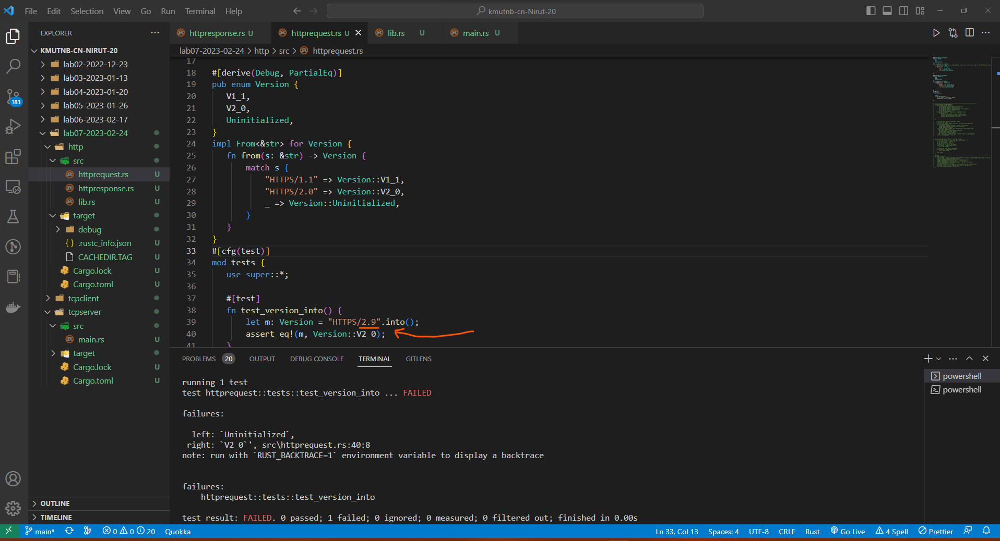
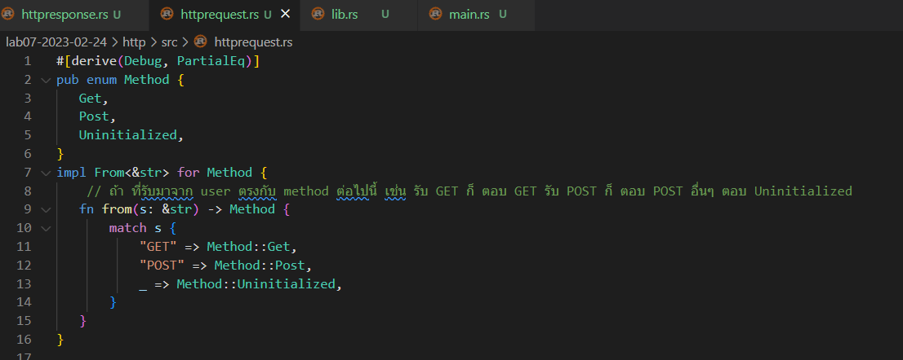
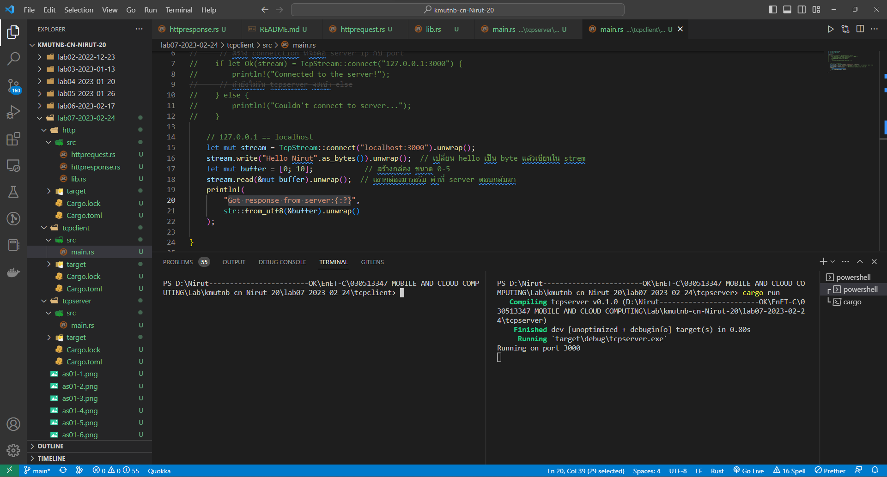
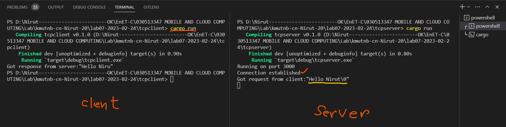

# 
**LAB Assignment 7**

## 1.ให้ Design httpRequest พร้อมเขียน code และรันแสดงผลลัพธ์

- **Note:** ทดสอบ Version ที่รับเข้ามา
***

- **Note:** ทดสอบ Version ที่รับเข้ามาผิด
***

- **Note:** ส่วนของ Method
***

- **Note:** ทดสอบ Method ที่รับมาเป็น GET
***

- **Note:** ทดสอบ Method ที่รับมาเป็น อย่างอื่นที่ไม่ใช้ GET และ POST
***

- **Note:** ทดสอบ Method ที่รับมาไม่ตรงกับที่ตั้งไว้
***
## 2.ให้ Design httpResponse พร้อมเขียน code และรันแสดงผลลัพธ์

- **Note:** รัน ฝั่ง server รอ
***

- **Note:** ทดสอบ รัน ฝั่ง client แล้วฝั่ง server ก็ Response กับมา
***
<marquee>6303051623055 นิรุท คุณวงค์ EnET-C KMUTNB</marquee>
`คำตอบอาจจะไม่ค่อยตรงกับคำถามเท่าไหร่ ก็ส่งเท่าที่ทำได้นะครับ 🥲`
